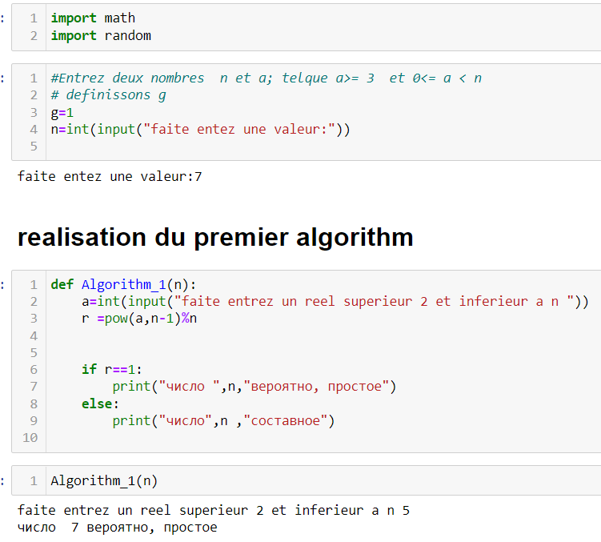
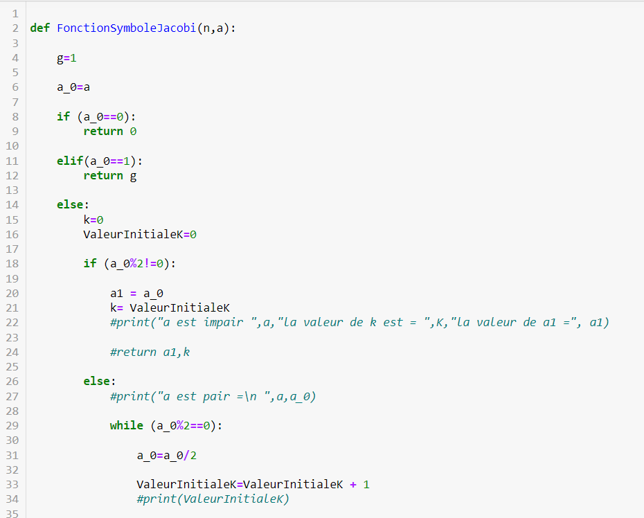
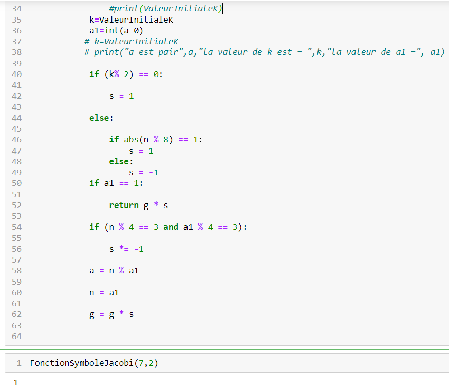
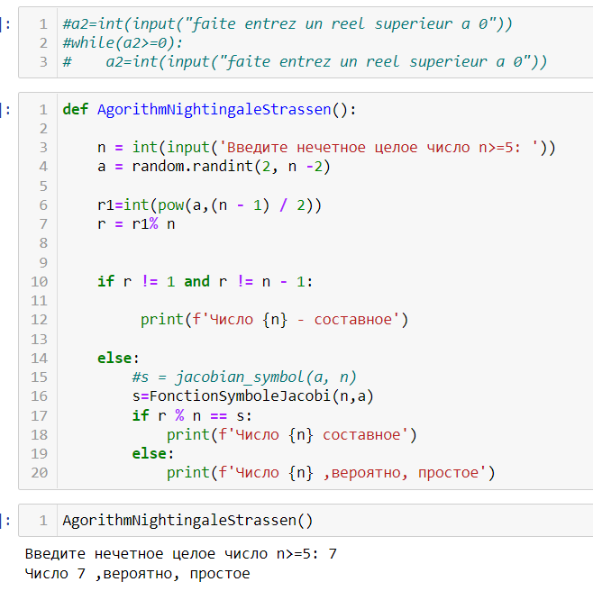
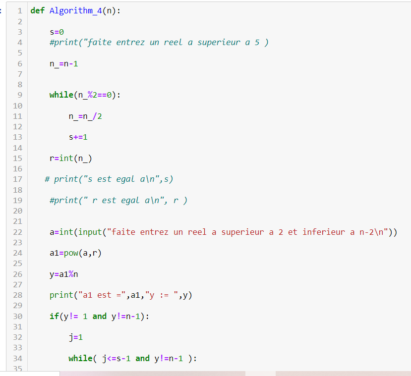
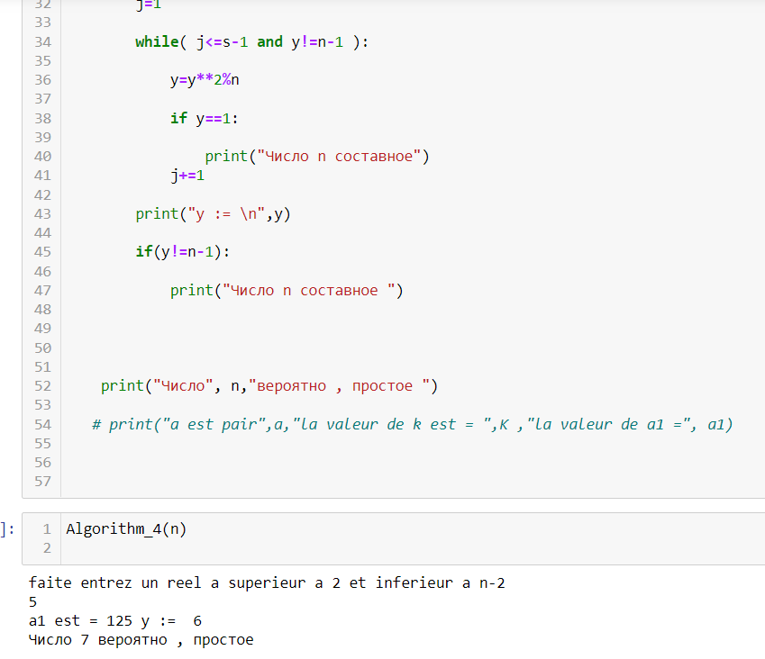

## РОССИЙСКИЙ УНИВЕРСИТЕТ ДРУЖБЫ НАРОДОВ  
## Факультет физико-математических и естественных наук  
## Кафедра прикладной информатики и теории вероятностей  

#### Презентауия по  
#### ЛАБОРАТОРНОЙ РАБОТЕ №5  
  

***дисциплина: Математические основы защиты информации и информационной безопасности***

Студент: Хиссен Али Уэддей   
Группа: НПМмд-02-20  
Ст. билет № 1032209306  

## Цель и задание работы

Изучиe  алгоритм для вычисления  Символ Якоби и основные  вероятные алгоритмы для проверки чисел на простоту..

 ## 1. Алгоритм, реализации тест Ферма 
Вход. Нечетное целое цисло n>=5.
Выход. “Число n,вероятно,простое” или “Число n составное”.

1.	Выбрать случайное целое число a, 2<=a<=2.

2.	Вычислить r = a^n-1^(mod n).
3.	Если r = 0 результат : “Число n,вероятно,простое”.В противном случае ре- зультат: “Число n составное”.
  

## 2.2 Алгоритм, для вычичления Символ Якоби
Вход. Нечетное целое цисло n>=3, целое число а,0 <= a < n.
Выход. Символ Якоби. 1. g=1
2.	если a =0 результат: 0

3.	если a =1 результат: g

4.	прадствить а в виде a = 2ka~1~ , где a~1~ нечетное.
5.	при четном k положить s=1, при нечетном положить s=1, если n=abs(1(mod8));по- ложить s=-1, если n=abs(3(mod8))
 
6.	при a1 результат: gs
7.	если n = 3(mod4) and a1 = 3(mod4) , то s = -s
8.	положить a = n mod(a1) n = a1 g = gs и вернуться на шаг 2

## 2.3	Алгоритм , реализующий тест Соловея - Штрассена
Вход. Нечетное целое цисло n>=5.
Выход. “Число n,вероятно,простое” или “Число n составное”.

1.	Выбрать случайное целое число a, 2<=a<=2.

2.	Вычислить r = a^(n+1)/2^(mod n)
3.	Если r не равен 1 и n-1 реузультат: “Число n составное”.

4.	Вычислить символ Якоби s = (a/n)

5.	Если r = s(mod n) реузультат: “Число n составное”, иначе “Число n,вероят- но,простое”.

## 2.4	Алгоритм , реализующий тест Миллера - Рабина
Вход. Нечетное целое цисло n>=5.
Выход. “Число n,вероятно,простое” или “Число n составное”.

1.	представить n-1 в виде n-1 = 2s^r^ , где r нечетное
2.	выбрать случайное целое число a, 2<=a<=2
3.	вычислить y = a^r^(mod n)
4.	при y не равном 1 и n-1 выполнить следующее
4.1.	положить j = 1
4.2.	если j <= s-1 и y не равен n-1 ,то
4.2.1.	положить y = y^2^(mod n)
4.2.2.	при y = 1 результат: "Число n составное"
4.2.3.	положить j = j+1
4.3.	при y не равном n-1 результат: "Число n составное"

5.	Результат: “Число n,вероятно,простое”

**Програмная чать** 

## 1. Алгоритм, реализации теста Ферма
вводим число n для дальнейших проверки на простоту

на данном скриншоте реализован алгоритм теста Ферма как функций в python 

## 2.2 Алгоритм, для вычичления Символ Якоби
на данном скриншоте реализован алгоритм для вычичления Символ Якоби как функций в python 

## 2.3	Алгоритм , реализующий тест Соловея - Штрассена
на данном скриншоте реализован алгоритм для вычичления Символ Якоби 

## 2.4	Алгоритм , реализующий тест Миллера - Рабина
на данном скриншоте реализован алгоритм  для вычичления Миллера - Рабина как функций в python

## выдод
Цель лабораторной работы была достигнута.
Мы изучали  алгоритм для вычисления  Символов Якоби и основных  вероятных алгоритмов для проверки чисел на простоту..