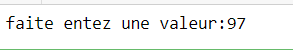
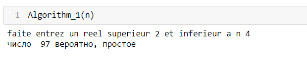

## РОССИЙСКИЙ УНИВЕРСИТЕТ ДРУЖБЫ НАРОДОВ

### Факультет физико-математических и естественных наук

### Кафедра прикладной информатики и теории вероятностей

#### ОТЧЕТ ПО

#### ЛАБОРАТОРНОЙ РАБОТЕ №5

***дисциплина: Математические основы защиты информации и информационной
безопасности***

Студент: Хиссен Али Уэддей\
Группа: НПМмд-02-20\
Ст. билет № 1032209306

## Цель работы

Изучиe алгоритм для вычисления Символ Якоби и основные вероятные
алгоритмы для проверки чисел на простоту..

# Теоретические часть


**1. Алгоритм, реализации тест Ферма** Вход. Нечетное целое цисло n>=5.
Выход. "Число n,вероятно,простое" или "Число n составное".

1.  Выбрать случайное целое число a, 2\<=a\<=2.

2.  Вычислить r = a^n-1^(mod n).

3.  Если r = 0 результат : "Число n,вероятно,простое".В противном случае
    ре- зультат: "Число n составное".

**2.2 Алгоритм, для вычичления Символ Якоби** Вход. Нечетное целое цисло
n>=3, целое число а,0 \<= a \< n. Выход. Символ Якоби. 1. g=1 2. если a
=0 результат: 0

3.  если a =1 результат: g

4.  прадствить а в виде a = 2ka~1~ , где a~1~ нечетное.

5.  при четном k положить s=1, при нечетном положить s=1, если
    n=abs(1(mod8));по- ложить s=-1, если n=abs(3(mod8))

6.  при a1 результат: gs

7.  если n = 3(mod4) and a1 = 3(mod4) , то s = -s

8.  положить a = n mod(a1) n = a1 g = gs и вернуться на шаг 2

**2.3 Алгоритм , реализующий тест Соловея - Штрассена** Вход. Нечетное
целое цисло n>=5. Выход. "Число n,вероятно,простое" или "Число n
составное".

1.  Выбрать случайное целое число a, 2\<=a\<=2.

2.  Вычислить r = a^(n+1)/2^(mod n)

3.  Если r не равен 1 и n-1 реузультат: "Число n составное".

4.  Вычислить символ Якоби s = (a/n)

5.  Если r = s(mod n) реузультат: "Число n составное", иначе "Число
    n,вероят- но,простое".

**2.4 Алгоритм , реализующий тест Миллера - Рабина** Вход. Нечетное
целое цисло n>=5. Выход. "Число n,вероятно,простое" или "Число n
составное".

1.  представить n-1 в виде n-1 = 2s^r^ , где r нечетное

2.  выбрать случайное целое число a, 2\<=a\<=2

3.  вычислить y = a^r^(mod n)

4.  при y не равном 1 и n-1 выполнить следующее 4.1. положить j = 1 4.2.
    если j \<= s-1 и y не равен n-1 ,то 4.2.1. положить y = y^2^(mod n)
    4.2.2. при y = 1 результат: "Число n составное" 4.2.3. положить j =
    j+1 4.3. при y не равном n-1 результат: "Число n составное"

5.  Результат: "Число n,вероятно,простое"

# Выполнение работы

## Реализация алгоритмов на языке Python

**1. Алгоритм, реализации тест Ферма**

``` python
import math 
#Entrez deux nombres  n et a; telque a>= 3  et 0<= a < n 
# definissons g 
g=1
n=int(input("faite entez une valeur:"))
```



``` python
def Algorithm_1(n):
    a=int(input("faite entrez un reel superieur 2 et inferieur a n "))
    r =pow(a,n-1)%n
    
    print(r)
    
    if r==1:
        print("число ",n,"вероятно, простое")
    else:
        print("число",n ,"составное")
```



**2.2 Алгоритм, для вычичления Символ Якоби**

``` python
def FonctionSymboleJacobi(n,a):
    
    g=1
    
    a_0=a
    
    if (a_0==0):
        return 0
    
    elif(a_0==1):
        return g
    
    else:
        k=0
        ValeurInitialeK=0
        
        if (a_0%2!=0):
            
            a1 = a_0
            k= ValeurInitialeK 
            print("a est impair ",a,"la valeur de k est = ",K,"la valeur de a1 =", a1)
            
            #return a1,k
        
        else:
            #print("a est pair =\n ",a,a_0)
            
            while (a_0%2==0):
                
                a_0=a_0/2
                
                ValeurInitialeK=ValeurInitialeK + 1
                print(ValeurInitialeK)
                
            k=ValeurInitialeK
            a1=int(a_0)
            
           # k=ValeurInitialeK
            print("a est pair",a,"la valeur de k est = ",k,"la valeur de a1 =", a1)
            
            if (k% 2) == 0:
                
                s = 1 
                
            else:
                
                if abs(n % 8) == 1:
                    s = 1 
                else:
                    s = -1
            if a1 == 1:
                
                return g * s
            
            if (n % 4 == 3 and a1 % 4 == 3):
                
                s *= -1 
                
            a = n % a1 
            
            n = a1
            
            g = g * s
            
```


**2.3 Алгоритм , реализующий тест Соловея - Штрассена**

``` python
def AgorithmNightingaleStrassen():

    n = int(input('Введите нечетное целое число n>=5: '))
    a = random.randint(2, n -2)
    
    r1=int(pow(a,(n - 1) / 2))
    r = r1% n 
    
  
    if r != 1 and r != n - 1:
        
         print(f'Число {n} - составное') 
    
    else:
        #s = jacobian_symbol(a, n)
        s=FonctionSymboleJacobi(n,a)
        if r % n == s:
            print(f'Число {n} составное') 
        else:
            print(f'Число {n} ,вероятно, простое')
```


**2.4 Алгоритм , реализующий тест Миллера - Рабина**

``` python
def Algorithm_4(n):
    
    s=0
    #print("faite entrez un reel a superieur a 5 )
    
    n_=n-1
    
        
    while(n_%2==0):
        
        n_=n_/2
        
        s+=1
     
    r=int(n_)
    
    print("s est egal a\n",s)
    
    print(" r est egal a\n", r )
    
    
    a=int(input("faite entrez un reel a superieur a 2 et inferieur a n-2\n"))
    
    a1=pow(a,r)
    
    y=a1%n
    
    print("a1 est =",a1,"y := ",y)
    
    if(y!= 1 and y!=n-1):
        
        j=1
        
        while( j<=s-1 and y!=n-1 ):
            
            y=y**2%n
            
            if y==1:
                
                print("Число n составное")
            j+=1
            
        print("y := \n",y)  
         
        if(y!=n-1):
            
            print("Число n составное ")
        
    
    
        
    print("Число", n,"вероятно , простое ")
    
   # print("a est pair",a,"la valeur de k est = ",K ,"la valeur de a1 =", a1)
    
    
```


**вывод** Мы изучали алгоритм для вычисления Символ Якоби и основные
вероятностные алгоритмы для проверки чисел на простоту..
